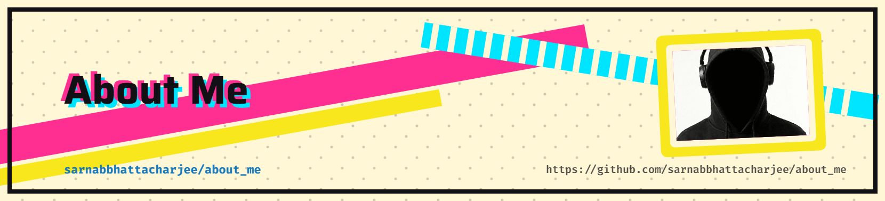

<!--
╔══════════════════════════════════════════════════════════════════════╗
║                  SARNAB BHATTACHARJEE · PROFILE                     ║
║                                                                      ║
║  SETUP                                                               ║
║  1. Replace YOUR_GITHUB_USERNAME with your actual GitHub username.   ║
║  2. Replace social links and email with your real profiles.          ║
║  3. Enable the contribution snake workflow in your profile repo.     ║
╚══════════════════════════════════════════════════════════════════════╝
-->

<!-- ═══════════════════════ HERO BANNER ═══════════════════════ -->
<picture>
   <source media="(prefers-color-scheme: dark)" srcset="art/header-dark.png">
   
</picture>

 

 

# SARNAB BHATTACHARJEE

### Full Stack Web Developer

  Crafting modern web experiences with thoughtful design, 
  scalable architecture, and clean, purposeful code.

 

&nbsp;

  

<!-- ═══════════════════════ ABOUT ═══════════════════════ -->

## 01 / THE DEVELOPER

<table>
<tr>
<td width="65%" valign="top">

### Beyond writing code.

I'm **Sarnab Bhattacharjee**, a Full Stack Web Developer passionate about building complete web experiences — from elegant interfaces to the backend systems that power them.

I enjoy working across the entire development process, combining responsive design, modern JavaScript frameworks, server-side logic, and database technologies to create applications that feel as good as they function.

**What drives me**

- Building polished, responsive user interfaces.
- Developing reliable backend systems and APIs.
- Creating maintainable, scalable web applications.
- Exploring better ways to design and engineer for the web.

**My approach**

`Thoughtful Design` → `Clean Code` → `Reliable Systems`

</td>
<td width="35%" align="center" valign="middle">

  

</td>
</tr>
</table>

 

&nbsp;

&nbsp;

---

<!-- ═══════════════════════ TECH STACK ═══════════════════════ -->

## 02 / THE TECHNOLOGY

  The tools I use to turn ideas into working software.

 

### Languages & Core Technologies

  

### Frameworks & Runtime

  

### Databases & Query Technologies

 

  SQL · Relational Databases · NoSQL · Document Databases

  

---

<!-- ═══════════════════════ CAPABILITIES ═══════════════════════ -->

## 03 / WHAT I BUILD

<table>
<tr>
<td width="50%" valign="top">

### ◈ Frontend Engineering

- Responsive, accessible web interfaces
- Modern component-driven applications
- Consistent layouts and design systems
- Interactive experiences and UI details

</td>
<td width="50%" valign="top">

### ◈ Backend Engineering

- Server-side application development
- API design and integration
- Application architecture and business logic
- Backend functionality and data processing

</td>
</tr>
<tr>
<td width="50%" valign="top">

### ◈ Data & Persistence

- SQL and relational data models
- NoSQL and document-based storage
- Database querying and data organization
- Application-to-database integration

</td>
<td width="50%" valign="top">

### ◈ End-to-End Development

- Full-stack application development
- Frontend and backend integration
- Version control and iterative development
- Maintainable, structured codebases

</td>
</tr>
</table>

---

<!-- ═══════════════════════ GITHUB METRICS ═══════════════════════ -->

## 04 / THE ACTIVITY

  Every commit is another step forward.

 

&nbsp;

  

  

 

  GitHub statistics are generated dynamically and may take time to update.

---

<!-- ═══════════════════════ CONTRIBUTION SNAKE ═══════════════════════ -->

## 05 / THE CONTRIBUTION TRAIL

  A visual trail of the work behind the code.

 

<!--
  CONTRIBUTION SNAKE SETUP

  Create this file in your profile repository:
  .github/workflows/snake.yml

  Add the workflow shown below, commit it, and enable GitHub Actions.
  The workflow publishes SVGs to the "output" branch.

  name: Generate Contribution Snake

  on:
    schedule:
      - cron: "0 0 * * *"
    workflow_dispatch:
    push:
      branches:
        - main

  permissions:
    contents: write

  jobs:
    generate:
      runs-on: ubuntu-latest
      steps:
        - name: Generate contribution snake
          uses: Platane/snk/svg-only@v3
          with:
            github_user_name: ${{ github.repository_owner }}
            outputs: |
              dist/github-contribution-grid-snake.svg
              dist/github-contribution-grid-snake-dark.svg?palette=github-dark

        - name: Publish snake
          uses: crazy-max/ghaction-github-pages@v4
          with:
            target_branch: output
            build_dir: dist
          env:
            GITHUB_TOKEN: ${{ secrets.GITHUB_TOKEN }}
-->

<picture>
  <source
    media="(prefers-color-scheme: dark)"
    srcset="https://raw.githubusercontent.com/YOUR_GITHUB_USERNAME/YOUR_GITHUB_USERNAME/output/github-contribution-grid-snake-dark.svg"
  />
  <source
    media="(prefers-color-scheme: light)"
    srcset="https://raw.githubusercontent.com/YOUR_GITHUB_USERNAME/YOUR_GITHUB_USERNAME/output/github-contribution-grid-snake.svg"
  />
  
</picture>

---

<!-- ═══════════════════════ CONNECT ═══════════════════════ -->

## 06 / FIND ME ELSEWHERE

  Have an interesting idea, a project to discuss, or just want to connect?

 

&nbsp;

&nbsp;

  

&nbsp;

&nbsp;

  

---

<!-- ═══════════════════════ FOOTER ═══════════════════════ -->

 

  Designed with intention. Developed with curiosity. Powered by code.

  

